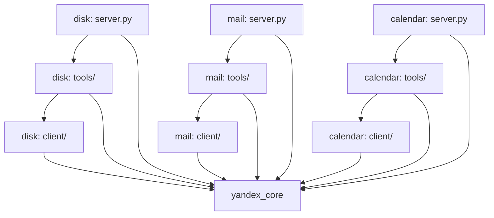

# Architecture Spine — Yandex MCP Connectors

## Design Paradigm

**Layered**, three layers per server, each a package directory:

| Layer | Directory | Knows about |
| --- | --- | --- |
| Entrypoint | `server.py` | Transport and the MCP application only |
| Tools | `tools/` | MCP contracts, validation, annotations, filtering, pagination |
| Client | `client/` | One wire protocol; nothing about MCP |

Hexagonal was considered and rejected: the three servers share no domain model by
design, so ports and adapters would wrap empty layers.

## Invariants & Rules



### AD-1 — Layered paradigm, three layers per server `[ADOPTED]`

- **Binds:** all three servers
- **Prevents:** protocol detail leaking into tool contracts, and MCP concepts leaking into protocol clients
- **Rule:** `tools/` never imports a protocol library (`caldav`, `imap_tools`, `httpx`); `client/` never imports `mcp`. A client module is usable from a plain script with no MCP present.

### AD-2 — Dependency direction is one-way

- **Binds:** all packages
- **Prevents:** a shared-utility drift where servers grow mutual imports and stop being independently runnable
- **Rule:** servers depend on `yandex_core`; `yandex_core` depends on no server; no server imports another server. Anything two servers need moves into `yandex_core` or is duplicated deliberately.

### AD-3 — One async boundary, inside the client layer

- **Binds:** all three servers
- **Prevents:** a half-async codebase, and blocking protocol calls stalling the event loop
- **Rule:** every tool function is `async def`. Blocking libraries are called only through `anyio.to_thread.run_sync`, and only from within `client/`. No `await` appears in `client/`; no blocking protocol call appears in `tools/`.

### AD-4 — Completeness is carried by type, never by convention

- **Binds:** NFR1, NFR2, NFR3, every tool that returns a collection or text
- **Prevents:** a partial result that is indistinguishable from a complete one — the failure mode the model cannot detect
- **Rule:** collections return `Page[T]`; text that may be cut returns `Chunk`. Both are defined in `yandex_core` with `complete: bool` and `next_cursor: str | None` as required fields. No tool returns a bare list or a bare string. When a tool filters locally over a source that was itself incomplete, the resulting `Page.complete` is `False`.

### AD-5 — One error taxonomy, owned by the core

- **Binds:** NFR4, all layers
- **Prevents:** three servers reporting the same condition three different ways, and raw protocol exceptions reaching the model
- **Rule:** `yandex_core.errors` defines the hierarchy (`AuthError`, `PermissionError`, `NotFound`, `Conflict`, `RateLimited`, `TransportError`, `ProtocolError`). Client code translates protocol exceptions at its own boundary and raises only these. The tool layer maps them to MCP errors. No protocol exception type crosses out of `client/`, and no failure is ever converted into an empty successful result.

### AD-6 — Credentials are resolved only by the core

- **Binds:** NFR7, FR4
- **Prevents:** three different credential paths, and secrets reaching argument lists or logs
- **Rule:** `yandex_core.credentials` is the only module that reads the keychain, the fallback file, or environment variables. Servers request a credential by service and profile and receive a live token or password. No secret is ever a tool argument, and log formatting redacts by field name.

### AD-7 — All times are timezone-aware

- **Binds:** FR1, FR2, NFR5
- **Prevents:** the calendar and mail servers disagreeing about what a date range means
- **Rule:** every datetime crossing any boundary is timezone-aware and serialised as ISO 8601 with an explicit offset. Naive datetimes are rejected at construction. Date-only values are typed as dates, never as midnight.

### AD-8 — Tool names follow `<server>_<object>_<verb>`

- **Binds:** all 26 tools
- **Prevents:** each server evolving its own naming dialect as tools are added
- **Rule:** the server segment is `disk`, `mail`, or `calendar`. The object segment is the plural noun for collection operations and singular for single-item operations. The verb is last. The object segment is omitted only when the server itself is the object, as in `disk_info`.

### AD-9 — Annotations come from one registry, not from each definition

- **Binds:** NFR6, all tools
- **Prevents:** an annotation being forgotten or set wrongly on a new tool, which would silently remove the client's confirmation step
- **Rule:** every tool declares a risk class in one table in `yandex_core`; annotations are derived from that class, never written inline. A tool with no entry fails at server start rather than registering unannotated. Every tool in the bulk class accepts `dry_run`, and `dry_run=True` performs no write and returns exactly the set that would be affected.

### AD-10 — No permanent-delete primitive exists

- **Binds:** FR2.10, FR3.10, NFR6
- **Prevents:** an unrecoverable mistake that reports success
- **Rule:** deletion routes to the service's trash. Client layers expose no permanent-delete call at all, so no tool can reach one by accident.

### AD-11 — Mutations state their scope and never overwrite blindly

- **Binds:** FR1.5, FR1.6, FR1.7
- **Prevents:** cancelling one meeting erasing a whole recurring series, and concurrent edits silently clobbering each other
- **Rule:** calendar mutations take a required `scope` of `occurrence` or `series` with no default. Updates send the ETag they read as a precondition; a mismatch raises `Conflict` and changes nothing. Disk uploads to an existing path require an explicit overwrite flag.

### AD-12 — Filtering belongs to the tool layer

- **Binds:** FR1.2, FR2.2, FR3.3, NFR3
- **Prevents:** a client silently narrowing results, making incompleteness invisible to the layer that must report it
- **Rule:** clients fetch using only the server-side filters known to be dependable — date ranges for IMAP and CalDAV, path and `media_type` for Disk. All other filtering happens in `tools/`, which owns the resulting `Page.complete` value. Clients never accept a text-match parameter.

## Consistency Conventions

| Concern | Convention |
| --- | --- |
| Tool names | `<server>_<object>_<verb>` per AD-8 |
| Modules | `client/` holds one module per protocol area; `tools/` holds one module per object with matching names |
| Identifiers | Disk uses paths, Mail uses `folder` plus UID, Calendar uses `uid` plus optional `recurrence_id`. Never a synthesised composite id |
| Dates | ISO 8601 with offset, timezone-aware, per AD-7 |
| Result shapes | `Page[T]` and `Chunk` from `yandex_core.results`, per AD-4 |
| Errors | `yandex_core.errors` hierarchy, per AD-5 |
| Cursors | Opaque base64 strings encoded and decoded by `yandex_core.paging`; callers never parse them |
| Config | Profiles in `~/.config/yandex-mcp/config.toml`, selected by `YANDEX_MCP_PROFILE` at start, read only by the core |
| Logging | To stderr only, never stdout, which carries the MCP protocol on stdio transport |
| Tests | `tests/unit` against fakes with no network; `tests/live` skipped unless `YANDEX_MCP_LIVE_TESTS=1` |

## Stack

Verified on PyPI, 2026-08-27.

| Name | Version |
| --- | --- |
| Python | 3.13 (floor 3.10, pinned via `uv`) |
| uv | 0.12.1 |
| mcp | 2.1.1 |
| pydantic | 2.13.4 |
| httpx | 0.28.1 |
| caldav | 3.2.1 |
| icalendar | 7.3.0 |
| recurring-ical-events | 3.8.2 |
| imap-tools | 1.15.0 |
| keyring | 25.7.0 |
| anyio | bundled with mcp |
| tzdata | 2026.3 |
| pytest | current |

The MCP Python SDK v2 renamed `FastMCP` to `MCPServer` and moved
`mcp.server.fastmcp.*` to `mcp.server.mcpserver.*`; `get_context()` is gone in favour of
a declared `ctx` parameter. Examples found online overwhelmingly target v1 and will not
run. Mail and Calendar clients are blocking and are used under AD-3.

## Structural Seed

```text
Claude-Yandex-Skill/
  pyproject.toml            # uv workspace root
  packages/
    yandex-core/src/yandex_core/
      config.py             # profiles, TOML loading
      credentials.py        # keychain and fallback, sole secret reader (AD-6)
      oauth.py              # authorization code flow, refresh
      errors.py             # error hierarchy (AD-5)
      results.py            # Page, Chunk (AD-4)
      paging.py             # opaque cursor encode/decode
      risk.py               # tool risk registry, annotation derivation (AD-9)
      app.py                # MCP application factory, transport-agnostic
    yandex-disk-mcp/src/yandex_disk_mcp/
      server.py
      tools/
      client/
    yandex-mail-mcp/src/yandex_mail_mcp/
      server.py
      tools/
      client/               # imap.py, smtp.py, mime.py
    yandex-calendar-mcp/src/yandex_calendar_mcp/
      server.py
      tools/
      client/               # caldav.py, recurrence.py
    yandex-mcp-cli/          # setup, login, verify (FR4)
  tests/
    unit/
    live/
```

## Capability → Architecture Map

| Capability | Lives in | Governed by |
| --- | --- | --- |
| FR1 Calendar tools | `yandex_calendar_mcp/tools/` | AD-1, AD-3, AD-4, AD-8, AD-11, AD-12 |
| FR1.2 recurrence expansion | `yandex_calendar_mcp/client/recurrence.py` | AD-1, `recurring-ical-events` |
| FR2 Mail tools | `yandex_mail_mcp/tools/` | AD-1, AD-3, AD-4, AD-8, AD-12 |
| FR2.3 body truncation | `yandex_mail_mcp/tools/` returning `Chunk` | AD-4 |
| FR3 Disk tools | `yandex_disk_mcp/tools/` | AD-1, AD-4, AD-8, AD-12 |
| FR2.8–FR2.10, FR3.9–FR3.10 destructive ops | respective `tools/` | AD-9, AD-10 |
| FR4 setup and verification | `yandex-mcp-cli` | AD-6 |
| NFR3 completeness | `yandex_core/results.py` | AD-4, AD-12 |
| NFR4 errors | `yandex_core/errors.py` | AD-5 |
| NFR7 credentials | `yandex_core/credentials.py` | AD-6 |
| NFR8 independent failure | one process per server | AD-2 |

## Deferred

| Deferred | Why it can wait |
| --- | --- |
| HTTP transport with OAuth | `app.py` is already transport-agnostic; nothing else is decided until a remote deployment is actually wanted |
| `this-and-following` calendar scope | Roughly doubles mutation logic for a case that is rare in practice |
| Permanent deletion | Deliberately unreachable per AD-10; revisit only if trash proves inadequate |
| Disk public share links, mail server-side rules, calendar sharing | Out of PRD scope; each is rare or better done in the web interface |
| Local metadata index | Unnecessary under a thousand files; revisit if Disk volume grows by an order of magnitude |
| Concurrency limits and retry policy | No observed pressure yet; the single-user load does not justify deciding it blind |
