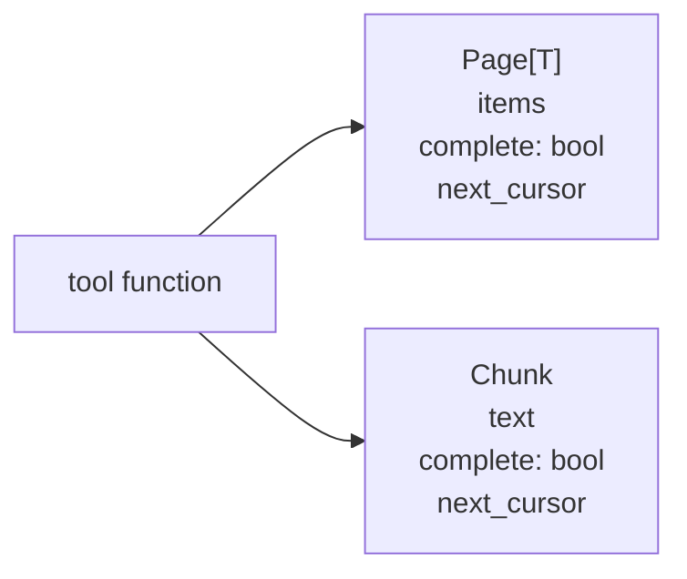
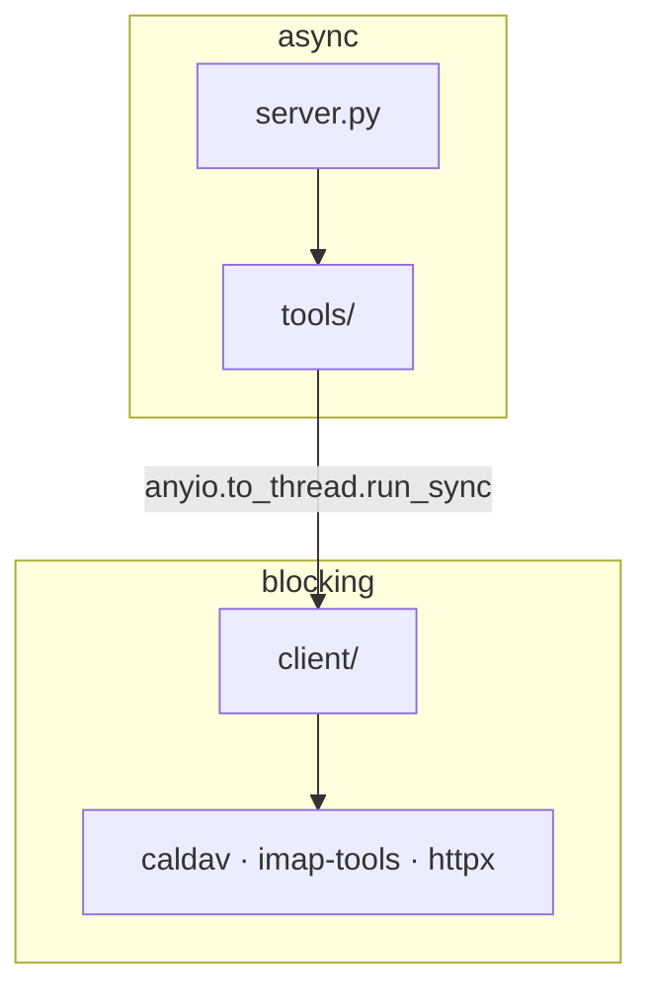

# Design Notes

The spine records what was decided. This records **why**, because in six months the
decisions will look arbitrary without it.

## The one fact that shaped everything

Yandex has no unified API. Google does, and that difference drives almost every
structural choice here.

| | Disk | Mail | Calendar |
| --- | --- | --- | --- |
| Protocol | REST | IMAP / SMTP | CalDAV |
| Auth | OAuth | OAuth via XOAUTH2 | **App password only** |
| Search | **None whatsoever** | Unreliable on Cyrillic | Date ranges only |

Every awkward-looking part of this architecture is downstream of that table. If a future
change makes something here feel over-engineered, check the table first — the constraint
is probably still there.

## Why three servers instead of one

One server would be one line of configuration instead of three, which is genuinely
nicer. It was rejected because the three protocols share nothing but authentication.
A single process means one crash takes out all three, permissions can only be granted
wholesale, and Claude sees twenty-six tools at once — which measurably degrades its
ability to pick the right one.

Three servers cost a little setup and buy independent failure, granular access, and a
smaller decision surface per server.

## Why the connectors know nothing about "projects"

An earlier draft put cross-service project history at the centre: join calendar meetings
to their emailed notes on a project key. It was cut, and the cut matters.

MCP exists so the model composes tools. Building the join into the servers would mean
inventing a project entity, deciding how it is derived, and maintaining that guess
forever — while Claude can do the same join at runtime from primitives, adapting to
whatever the data actually looks like. The connectors stay ignorant; the intelligence
stays where it belongs.

The tracing exercise that produced this insight is still worth keeping: it established
which primitives must exist, which is exactly what a scenario should do for a toolkit.

## Why filtering happens locally

This is the least obvious decision and the most important one.

Server-side filters would be cheaper. They are not used because none of them can be
trusted to return *everything* that matches. Disk has no filter at all. Yandex's IMAP
text search misreports on Cyrillic when criteria are combined. CalDAV `text-match` may
work but cannot be proven never to under-return.

Under-returning is uniquely dangerous with a language model. A result that is missing
items looks exactly like a complete result. The model cannot tell, so it answers
confidently and wrongly — and you have no way to notice.

So: fetch by date, the one filter both IMAP and CalDAV handle dependably, and filter in
our own code where completeness is knowable. It costs bandwidth and buys a guarantee.

## Why completeness is a type and not a rule

Given the above, `Page` and `Chunk` exist so that no tool can return data without
answering "is this everything?". A convention would have worked for the first five tools
and been forgotten by the twentieth.

`Chunk` was added late. The first design had only `Page`, which covered lists — and left
message-body truncation uncovered, precisely where bodies are longest and the risk of
quiet loss is highest. The adversarial review caught it. If a third kind of truncation
appears, it needs the same treatment.

## Why the async boundary sits inside the client layer

The MCP SDK is async. `caldav` and `imap-tools` are blocking, and there is no mature
async CalDAV library to switch to. Something has to give.

Calling a blocking library directly from an async tool would stall the event loop.
Making everything blocking would fight the SDK and foreclose the HTTP transport later.
So the tool layer is uniformly async, and blocking calls are wrapped exactly once,
inside `client/`, via `anyio.to_thread.run_sync`.

The reason to fix this in the spine rather than leave it to taste: two people solving it
independently will solve it differently, and a codebase half-wrapped and half-not is
worse than either approach applied consistently.

## Why `scope` has no default

Most meetings in this calendar recur. In CalDAV a recurring series is one record with an
`RRULE`, so "delete the event" is ambiguous at the protocol level: add one `EXDATE`, or
delete the record.

Any default is wrong some of the time, and one direction is catastrophic — a model
cancelling one meeting would erase a year of history and report success. Requiring the
caller to say `occurrence` or `series` costs one argument and removes the failure mode
entirely.

`this-and-following` is a real third case, deferred because it roughly doubles the
mutation logic for something rarely needed.

## Why nothing can be permanently deleted

Both Disk and Mail have a trash. Routing every removal through it means any mistake is
recoverable by you, in the web interface, without touching this code.

The rule is enforced by *absence*: the client layers expose no permanent-delete call, so
no tool can reach one even by accident. That is stronger than a policy against using it.

## Things that will surprise you later

**The MCP SDK v2 rename.** `FastMCP` is now `MCPServer`, and `mcp.server.fastmcp.*`
moved to `mcp.server.mcpserver.*`. Nearly every example online targets v1 and will not
run. When something copied from a tutorial fails to import, this is why.

**The Python floor.** The system `python3` is 3.9.6; `mcp` needs 3.10 or newer. The
interpreter is pinned through `uv`, deliberately leaving the system Python alone.

**Cyrillic IMAP search was never actually verified.** It is reported broken by many
developers, and the design routes around it, so it does not matter today. But it is an
assumption, not a measurement — do not let it harden into folklore.

**Disk's missing search stopped mattering only because of scale.** Under a thousand
files, one request returns everything and local filtering is provably complete. At ten
thousand this needs caching; at a hundred thousand, a different design. If the disk
grows an order of magnitude, revisit before assuming the code still holds.
